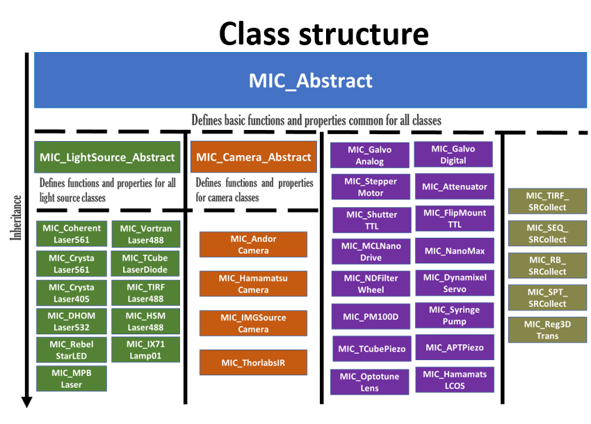

# matlab-instrument-control
MATLAB Instrument Control (MIC) is a collection of MATLAB classes for automated data collection on complex, multi-component custom built microscopes.

The MIC software package uses object-oriented programming where a class defines the capabilities of each instrument. Each instrument class inherits from a common MIC abstract class and therefore has a basic common interface. Common component types (lasers, camera, etc.) have their own further abstract sub-classes to provide common interfaces and to facilitate the development of control classes for specific new instruments. Use of the MATLAB environment allows immediate access to data and image analysis even during data collection.  Proficient MATLAB users can also easily extend or modify any of these control classes. 

<!-- ## Class Structure of MIC -->
<!-- <p align="center"></p> -->

## Class Structure Overview

 The structure of MIC is designed to ensure scalability and easy integration of new hardware.

### abstract
- Defines basic functions and properties common across all classes.
  - `abstract`

### camera
- The camera is the base class for all camera-related classes, defining common functions and properties.
  - `abstract`
  - `AndorCamera`
  - `AndorCameraZyla`
  - `DCam4Camera`
  - `HamamatsuCamera`
  - `Imaq`
  - `IMGSourceCamera`
  - `ThorlabsIR`
  - `ThorlabsSICamera`
  - `PyDcam`
  - `example`

### lightSource
- The lightSource is the base class for all light sources (e.g., lasers), defining common functions and properties.
  - `abstract`
  - `CoherentLaser561`
  - `CrystaLaser561`
  - `CrystaLaser405`
  - `DHOMLaser532`
  - `MPBLaser`
  - `RebelStarLED`
  - `VortranLaser488`
  - `TubeLaserDiode`
  - `TIRFLaser488`
  - `HSMLaser488`
  - `IX71Lamp01`
  - `example`

### linearStage
- The linearStage is the abstract class for linear stages.
  - `abstract`
  - `MCLMicroDrive`
  - `KCubePiezo`
  - `TCubePiezo`
  - `example`

### powermeter
- The powermeter creates an interface with the power meter.
  - `abstract`
  - `PM100D`
  - `example`
  
### stage3D
- The stage3D is a class for 3D stages.
  - `abstract`
  - `MCLNanoDrive`
  - `NanoMaxPiezos`
  - `example`

This class structure is integral to the functioning and expansion of our imaging capabilities, facilitating easy maintenance and upgrading of the imaging system components.


## Common Features
Each of the instrument components in MIC have export methods, unit tests and graphical user interfaces with a common format.

### Export state method
The current state of the individual instrument can be obtained using the function `exportState`. The output of the `exportState` function is organized as Attributes, Data and Children.  

Example: 
```
[Attributes, Data, Children] = TIRFLaser488.exportState()
```
`Attributes` is a structure with fields carrying information on the current state of the instrument. In the example, Attribute is a structure with fields `Power`, `IsOn` and `InstrumentName`. 

`Data` contain any data associated with the instrument.

`Children` contain exportState output from children instrument components (if any) called within the parent instrument class. 


### Functional test (funcTest) method
Each instrument component class in MIC comes equipped with a static method unit test. The `funcTest` function cycles through a series of pre-defined tests, uniquely selected for the corresponding instrument component, outputting success status. Common steps in the functional test method are creating the object, turning the instrument On/Off, change/modify state of the instrument, output exportState and deleting the object.  

**It is important to know the input arguments needed for calling the class on a particular instrument component before calling the funcTest.** This information can be obtained by performing a `doc` function on the corresponding MIC class.

Example: 
```
Success=TCubeLaserDiode.funcTest('64864827','Power',10,100,1)
```

### Graphical user interface
Instument component classes in MIC also come equipped with graphical user interfaces (gui). Classes inheriting from the same instrument abstract class share a common gui, located in the abstract class folder. For all other instrument components, the corresponding gui scripts are stored in the local folder.

Example: 
```
DynamixelServo.gui
```

## Installation notes
Each instrument will be controlled by its own drivers, which must be installed on the system. In many cases, the manufacturer's software development kit (SDK) is provided to create custom applications for controlling the instrument. When installing the drivers, either a header file or dynamic-link library is installed. For example, the `MCLNanoDrive` class controls the Mad City Labs 3D Piezo stage and requires the `madlib.h` header file. During the first initialization of this class on a system, users are prompted to set the location of the `madlib.h` header file, typically located in `C:\Program Files\Mad City Labs\NanoDrive`. 

Similarly, the `MCLMicroDrive` class controls the Mad City Labs Micro Stage and requires the `MicroDrive.dll` dynamic-link library. The first time this class is used on a given computer, the user will be prompted to select the location of `MicroDrive.dll`. On a Windows machine, this is typically placed by default in `C:\Program Files\Mad City Labs\MicroDrive\MicroDrive.dll` during the installation process (installation files provided by MCL).

## Projects using MIC
- Pallikkuth S, Martin C, Farzam F, Edwards JS, Lakin MR, Lidke DS, et al. (2018) Sequential super-resolution imaging using DNA strand displacement. PLoS ONE 13(8): e0203291. https://doi.org/10.1371/journal.pone.0203291
- Fazel, M., Wester, M.J., Schodt, D.J. et al. High-precision estimation of emitter positions using Bayesian grouping of localizations. Nat Commun 13, 7152 (2022). https://doi.org/10.1038/s41467-022-34894-2

## Related software
- `Micro-Manager` is a customizable platform for controlling microscopy systems, supporting a wide range of hardware devices, and is primarily built on Java. This software can be obtained from:https://micro-manager.org/
- `PYME (PYthon Microscopy Environment)` which is Python based environment is designed to facilitate image acquisition and data analysis in microscopy, with a focus on super-resolution techniques like PALM, STORM, and PAINT. This software can be obtained from GitHub:https://github.com/python-microscopy/python-microscopy

## Documentation
The detailed documentation of each MIC class can be found here: [MIC Classes](doc/MICclasses.md).

## Contribution
We welcome contributions to the MIC project. Please see [CONTRIBUTING](doc/CONTRIBUTING.md) for more information.
