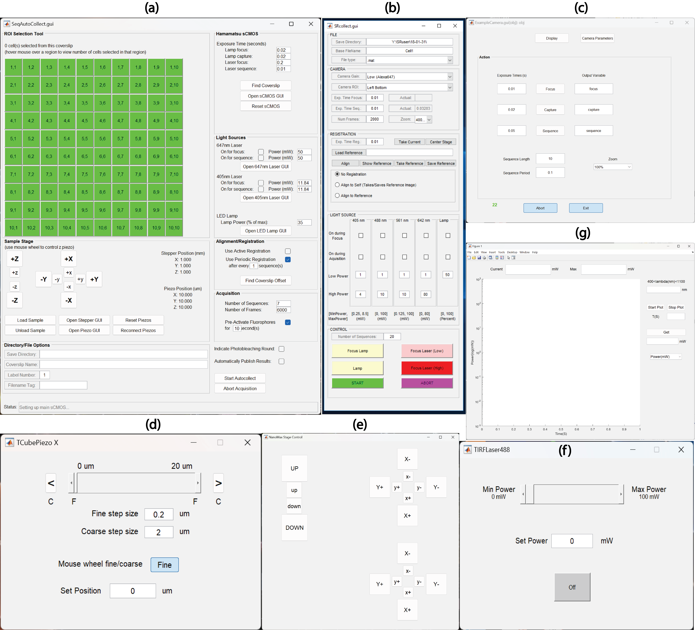

# Summary
Fluorescence single molecule imaging encompasses several techniques used to detect individual fluorescent molecules. Instrument control is fundamental to the reliability, accuracy, and efficiency of techniques used in detecting individual fluorescent molecules, enabling precise scientific investigations at the molecular level.MATLAB Instrument Control (MIC) is a software package consisting of MATLAB classes designed to facilitate automated data collection for complex, custom-built microscopes. Utilizing object-oriented programming, MIC assigns each instrument a class that details its capabilities. These classes inherit from a common MIC abstract class, ensuring a uniform interface across different instruments. Additionally, key components such as lasers, stages, and cameras are grouped under further abstract subclasses, which standardize interfaces and simplify the development of control classes for new instruments. The integration with MATLAB allows users to immediately access and analyze data and images during collection. Moreover, the environment supports proficient MATLAB users in easily extending or modifying the control classes, enhancing flexibility and functionality.
# Statement of need
Single molecule fluorescence imaging includes various methods for detecting individual fluorescent molecules. Many of these methods focus on localizing single fluorescent molecules with precision surpassing the diffraction limit, which constrains the spatial resolution of (visible) light-based microscopes. These techniques are extensively employed to visualize biological structures at the nanometer level by labeling them with fluorescent tags, thereby revealing intricate details of the biological activity observed. Two common techniques in Single molecule fluorescence imaging are Single-molecule localization microscopy (SMLM)[@Lidke_article:2005;@Betzig_article:2006;@Rust_article:2006;@Hell_article:2007], which is employed to generate two-dimensional or three-dimensional super-resolution images of structures that are static or nearly static, and single-particle tracking (SPT) [@Shen_article:2017], which is used to observe the trajectory of a single or a small number of tagged molecules in motion. While traditional imaging techniques often rely on commercial microscopy systems, emerging scientific applications frequently necessitate the custom design and specialized control of microscopy setups. Although hardware components for such innovative systems are readily accessible, there is a notable gap in the availability of open source software packages that can control these fluorescence imaging systems effectively.

To address this critical need, we have developed the MATLAB Instrument Control (MIC) software package, freely available and specifically tailored for the customization and automation of complex, multi-component microscopy systems[@Pallikkuth_article:2018]. MIC leverages MATLAB's (MathWorks Inc.) robust environment for object-oriented programming, allowing users to control diverse instrumentation through a unified interface. Each instrument class within MIC inherits from a common abstract class, ensuring consistency while enabling flexibility to accommodate a variety of components like lasers, stages, and cameras.

MIC not only supports the development and control of new instruments but also integrates seamlessly with MATLAB's comprehensive data and image analysis tools, as well as with SMITE[@Schodt:2023] allowing researchers to process data in real-time during experiments. This capability is crucial for iterative testing and development in experimental setups. For example, the SMLM/SPT analysis software suite SMITE was developed in sync with MIC, so acquiring data and performing analyses flow smoothly. Additionally, MIC is designed to be user-friendly for those familiar with MATLAB, offering customizable control classes, extensive export methods, unit tests, and graphical user interfaces for each instrument component.

An exemple of MIC’s utility is demonstrated through a ready-to-use class (SeqAutoCollect) specifically designed for dSTORM based super-resolution imaging systems. This class includes an intuitive graphical user interface that manages multiple excitation lasers and camera settings, simplifying complex data collection tasks. The SeqAutoCollect GUI is represented in Figure-1 (a). *Figure-1: MIC Graphical User Interfaces(GUI) (a) SeqAutoCollect GUI (b) TIRF SR Collect GUI (c) Camera control GUI (d) Linear stage (TCubePiezo X) GUI (e) 3D stage (NanoMax Stage Control) GUI (f) Light source (TIRF Laser488) GUI (g) Power meter GUI*.

Micro-Manager[@Edelstein2010], an alternative platform for controlling microscopy systems, and is also customizable, supporting a wide range of hardware devices, is primarily built on Java and operates independently of MATLAB. Micro-Manager comes with its own GUI. The interface and controls are based on Java, which might require users to adapt if they are not familiar with Micro-Manager’s own system or Java programming. While MIC is specifically designed for integration with MATLAB, MIC benefits from MATLAB’s extensive analytical and computational capabilities. It is developed in MATLAB and leverages its object-oriented programming features. This integration allows for immediate data processing and image analysis during data collection, which is particularly valuable for users who are already proficient in MATLAB and rely on its ecosystem for their research workflows.

MIC is designed to operate with HDF5 (Hierarchical Data Format) files which efficiently store very large datasets, while Micro-Manager can save files in three formats: separate image files, Image file stack (OME-Tiffs) and NDTiff. The HDF5 format is particularly useful for storing large datasets, as it allows for efficient data storage and retrieval. This is especially important for single molecule fluorescence imaging, where large amounts of data are generated during experiments. The HDF5 format is also supported by MATLAB, which makes it easy to import and analyze data stored in this format. In contrast, the OME-Tiff format used by Micro-Manager is not as efficient for storing large datasets, as it requires multiple files to be stored separately. This can make it difficult to manage and analyze large datasets, especially when working with single molecule fluorescence imaging data. The NDTiff format used by Micro-Manager is more efficient than OME-Tiff, but it is still not as efficient as HDF5 for storing large datasets. This makes MIC a more suitable choice for researchers working with large datasets in single molecule fluorescence imaging.

# Author Contributions

KAL conceived and supervised the development of MIC.
SK added the example classes with their GUIs, and added unit tests. 
KAL added MIC_AndorCamera and MIC_KCubePiezo. 
SP added MIC_AndorCameraZyla and various laser classes {MIC_CrystaLaser405, MIC_CrystaLaser561, MIC_DHOMLaser532}.
MBMM added MIC_DynamixelServo, MIC_GalvoAnalog, and MIC_HamamatsuLCOS class.
DJS added 3D registration, MIC_BiochemValve, MIC_CavroSyringePump, MIC_H5, and MIC_MCLMicroDrive.
MF added MIC_Attenuator and MIC_StepperMotor. 
HMF added MIC_3DStage_Abstract, MIC_CoherentLaser561, MIC_GalvoDigital, MIC_IRSyringPump, and MIC_MCLNanoDrive.
SL & FF added MIC_SEQ_SRcollect. 
SL, SP, MBMM added MIC_TIRF_SRcollect. 
ET added MIC_DMP40 and updated MIC_Triggerscope.
FF added MIC_FlipMountTTL, MIC_ShutterTTL. 
SP & SK added MIC_NanoMax.
SK added GitHub documentation.
SK wrote the manuscript.
All authors reviewed the manuscript.

# Acknowledgements

This work was supported by grants?

# References

