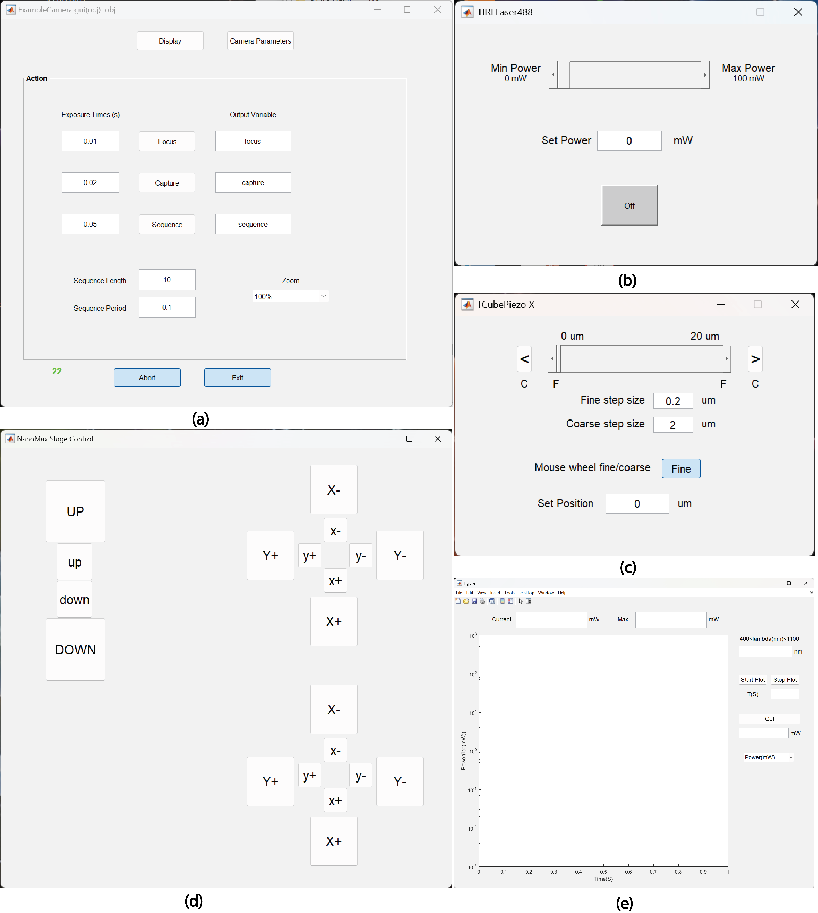

# Summary
MATLAB Instrument Control (MIC) is a software package designed to facilitate data collection for custom-built microscopes. Utilizing object-oriented programming, MIC provides a class for each low-level instrument. These classes inherit from a common MIC abstract class, ensuring a uniform interface across different instruments. Key components such as lasers, stages, power meter and cameras are grouped under abstract subclasses, which standardize interfaces and simplify the development of control classes for new instruments.  Both simple and complex systems can be built from these lower level tools. Since the interoperation is developed by the end user, the modes or sequence of operations can be flexibly designed with interactive or automated data collection and integrated analysis. MATLAB provides the ability to create GUIs and therefore MIC allows for both rapid prototyping and for building custom, high-level user interfaces that can be used for production instruments.   

# Statement of need
Development of new microscopy methods often require integration of novel components and/or novel workflows between low-level hardware.  Creating bespoke software solutions for each new instrument or for prototyping can significantly slow down the development cycle.  It is also often desirable to be able to quickly analyze incoming data during development.  To address this critical need, we have developed the MATLAB Instrument Control (MIC) software package, freely available and specifically tailored for the customization and automation of complex, multi-component microscopy systems[@Pallikkuth_article:2018]. MIC leverages MATLAB's (MathWorks Inc.) robust environment for object-oriented programming, allowing users to control diverse instrumentation through a unified interface. Each instrument class within MIC inherits from a common abstract class, ensuring consistency while enabling flexibility to accommodate a variety of components like lasers, stages, and cameras.The source code for MIC has been archived to GitHub: https://github.com/LidkeLab/matlab-instrument-control.

MIC not only supports the development and control of new instruments but also integrates seamlessly with MATLAB's comprehensive data and image analysis tools, as well as with SMITE[@Schodt:2023] allowing researchers to process data in real-time during experiments. This capability is crucial for iterative testing and development in experimental setups. For example, the SMLM/SPT analysis software suite SMITE was developed in sync with MIC, so acquiring data and performing analyses flow smoothly. Additionally, MIC is designed to be user-friendly for those familiar with MATLAB, offering customizable control classes, extensive export methods, unit tests, and graphical user interfaces for each instrument component.

An example of MIC’s utility is demonstrated through a custom-built Sequential microscope [@10.1371/journal.pone.0203291] specifically designed for dSTORM and DNA-PAINT based super-resolution. Another usage of MIC is demonstrated through a class designed for TIRF based super-resolution imaging systems [@Fazel2022]. Each of these classes includes an intuitive graphical user interface that manages multiple excitation lasers and camera settings, simplifying complex data collection tasks. The MIC GUIs are represented in Figure-1. *Figure-1: MIC Graphical User Interfaces(GUIs); (a) Camera control GUI (b) Light source (TIRF Laser488) GUI (c) Linear stage (TCubePiezo X) GUI (d) 3D stage (NanoMax Stage Control) GUI (e) Power meter GUI*.

MIC is designed to operate with HDF5 (Hierarchical Data Format) files which efficiently store very large datasets. The HDF5 format is particularly useful for storing large datasets, as it allows for efficient data storage and retrieval. This is especially important for single molecule fluorescence imaging, where large amounts of data are generated during experiments. The HDF5 format is also supported by MATLAB, which makes it easy to import and analyze data stored in this format. 

There are a few other software packages that allow users to control and synchronize multiple hardware components for microscopy applications. Notable examples include Micro-Manager[@Edelstein2010], based in Java, and PYME (the PYthon Microscopy Environment)[@PYME2020], based in the Python environment.  Potential users of MIC are encouraged to compare and contrast MIC with these packages to assess what might be best for their particular development environment. Micro-Manager is a customizable platform for controlling microscopy systems, supporting a wide range of hardware devices, and is primarily built on Java. Micro-Manager comes with its own GUI. Micro-Manager can save files in three formats: separate image files, Image file stack (OME-Tiffs) and NDTiff. Micro-Manager may be a good choice for those who primarily use ImageJ/Fiji for image analysis. PYME is designed to facilitate image acquisition and data analysis in microscopy, with a focus on super-resolution techniques like PALM, STORM, and PAINT. It runs on multiple platforms, including Windows, Linux, and OSX. PYME comprises several key components: PYMEAcquire for microscope and camera control, PYMEVisualize for visualizing localization data sets, and PYMEImage for viewing and processing raster images. PYME is compatible with a variety of data formats, including its proprietary .pzf format as well as standard formats such as .tif. Additionally, PYME supports metadata in multiple formats, including .json, .md, and .xml.

# Author Contributions

KAL conceived and supervised the development of MIC.
SK wrote the manuscript.
SK & MJW added GitHub documentation.
SK added the example classes with their GUIs, and added unit tests. 
KAL added MIC_AndorCamera and MIC_KCubePiezo. 
SP added MIC_AndorCameraZyla and various laser classes. SK tested the laser classes.
SL added MIC_DCAM4Camera to control Hamamatsu cameras using the DCAM4 API.
MBMM added MIC_DynamixelServo, MIC_GalvoAnalog, and MIC_HamamatsuLCOS class.
DJS added 3D registration, MIC_BiochemValve, MIC_CavroSyringePump, MIC_H5, and MIC_MCLMicroDrive.
MF added MIC_Attenuator and MIC_StepperMotor. 
HMF added MIC_3DStage_Abstract, MIC_CoherentLaser561, MIC_GalvoDigital, MIC_IRSyringPump, and MIC_MCLNanoDrive.
ET added MIC_DMP40 and updated MIC_Triggerscope.
FF added MIC_FlipMountTTL, MIC_ShutterTTL. 
SP & SK added MIC_NanoMax.
All authors reviewed the manuscript.

# Acknowledgements

This work was supported by NIH grants 1R01GM140284, 
K12GM088021 (ASERT-IRACDA program),
NCI P30CA118100,
NCI R01CA248166,
NIGMS R01GM109888,
NIGMS R21GM104691,
NIGMS R21GM132716,
NIGMS R35GM126934,
NCRR RR024438,
NIGMS 1R01GM140284,
NIBIB 1R21EB019589,
NIGMS 5P50GM085273 (New Mexico Spatiotemporal Modeling Center);
NSF grants 0954836 and 2039517; DOE grant DE-SC0019267;
support from the University of New Mexico Office of the Vice President for
Research Program for Enhancing Research Capacity; and
supported by grants from NVIDIA and utilized an NVIDIA A6000 GPU.

# References

